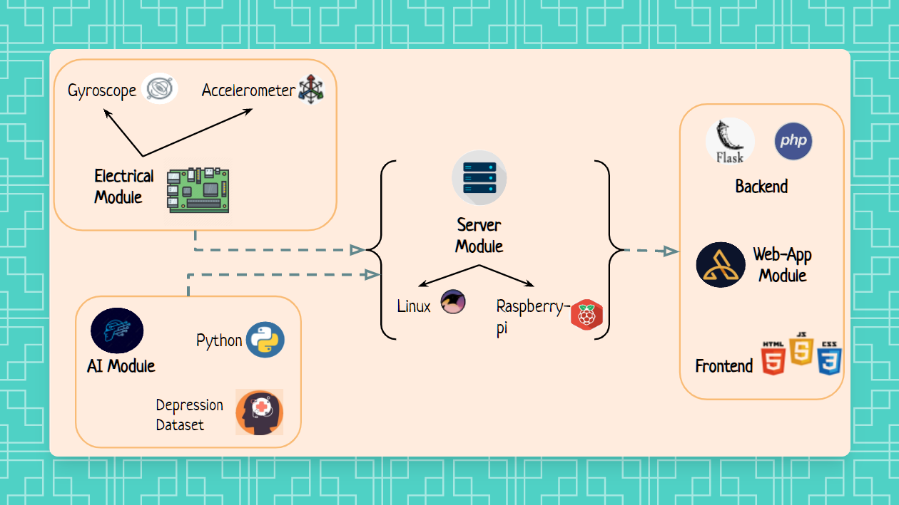

## Depression Detection using CNN model and ML Techniques

  

## Description
### Website "Calm Aura"
Calm Aura helps you monitor your depression and brings together techniques from mindfulness based cognitive therapy, positive psychology, and behavioural activation into a self-help space for mental wellbeing to guide you in managing and improving your mental health. Techniques such as recognising three good things in a gratitude journal and closely analysing your emotional symptoms.

## System Architecture

  

## Hadware Simulation

  

